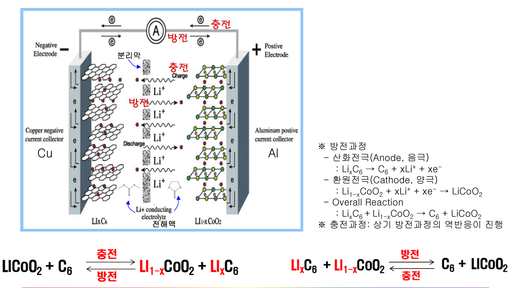

# 전지의 종류
일차 전지
: 방전기능만 작동하여 충전하여 사용할 수 없는 전지

 즉, 반복 사용이 불가능한 전지
 
 (ex) 망간 건전지, 알카라인 전지, 수은전지, 리튬계 전지 등 

이차 전지
: 충전과 방전을 500회 이상 연속적으로 반복 사용이 가능한 반영구적 화학전지

# 리튬 이온 전지
작고 가벼우면서도 에너지 밀도, 출력특성, 장시간 사용 등 성능 면에서 가장 우수한 특성을 가지며, 현재 가장 많이 이용

## 리튬 이온 전지 원리

# 리튬이온배터리의 구성

# 양극재의 종류

# 양극재 제조 공정

# 참고 자료
<http://contents.kocw.or.kr/KOCW/document/2014/cu/hanyoonsoo/1.pdf>

## Subtitle
### Next
#### Next Next
test