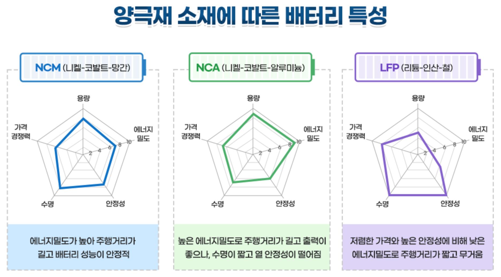

# 전지의 종류
일차 전지
: 방전기능만 작동하여 충전하여 사용할 수 없는 전지

 즉, 반복 사용이 불가능한 전지
 
 (ex) 망간 건전지, 알카라인 전지, 수은전지, 리튬계 전지 등 

이차 전지
: 충전과 방전을 500회 이상 연속적으로 반복 사용이 가능한 반영구적 화학전지

# 리튬 이온 전지
작고 가벼우면서도 에너지 밀도, 출력특성, 장시간 사용 등 성능 면에서 가장 우수한 특성을 가지며, 현재 가장 많이 이용

## 리튬 이온 전지의 구조와 작동 원리

- 리튬 이온 전지는 리튬 이온이 양극재와 음극재 사이를 이동하는 화학적 반응을 통해 전기를 만들어 냄
- 양극의 리튬 이온이 음극으로 이동하며 배터리가 충전되고, 음극의 리튬 이온이 양극으로 돌아가며 에너지를 방출, 방전됨
- 이때 전해질이 양극과 음극 사이에서 리튬 이온의 이동통로 역할을 하며, 분리막 사이에 존재하여 이 전해질과 양극과 음극이 서로 닿지 않도록 함

### 양극재
- 원소 상태의 리튬은 불안정하여 리튬과 산소를 결합한 리튬 산화물 형태가 양극에 사용됨
- 배터리의 용량과 전압을 결정하는 소재임

### 음극재
- 음극재는 흑연이 주로 사용되며 더 큰 용량과 빠른 충전 속도를 목표로 실리콘 음극재 등 차세대 음극재 개발이 진행되고 있음

### 전해질
- 전해질은 배터리 내부의 양극과 음극 사이에서 리튬 이온이 원활하게 이동하도록 돕는 매개체로 리튬 이온의 원활한 이동을 위해 이온 전도도가 높은 물질이어야 하며, 안전을 위해 전기화학적 안정성, 발화점이 높아야 함 
- 또한 전자 전도를 막아 외부 도선으로만 전류가 흐를 수 있도록 함

### 분리막
- 분리막은 양극과 음극의 물리적 접촉을 차단하는 역할
- 미세한 구멍이 있어 리튬 이온은 통과할 수 있어야 함

# 양극재의 종류

# 양극재 제조 공정

# 참고 자료
<http://contents.kocw.or.kr/KOCW/document/2014/cu/hanyoonsoo/1.pdf>
<https://inside.lgensol.com/2021/11/%EB%A6%AC%ED%8A%AC%EC%9D%B4%EC%98%A8%EB%B0%B0%ED%84%B0%EB%A6%AC%EC%9D%98-%EA%B5%AC%EC%A1%B0%EC%99%80-%EC%9E%91%EB%8F%99-%EC%9B%90%EB%A6%AC/>
<https://newsroom.posco.com/kr/궁금한-the-이야기-②-배터리-성능을-올려라-양극재/>
<https://inside.lgensol.com/2022/03/%EC%96%91%EA%B7%B9%EC%9E%AC-%EC%A0%9C%EC%A1%B0%EC%9D%98-%ED%95%B5%EC%8B%AC-%EC%A0%84%EA%B5%AC%EC%B2%B4/>